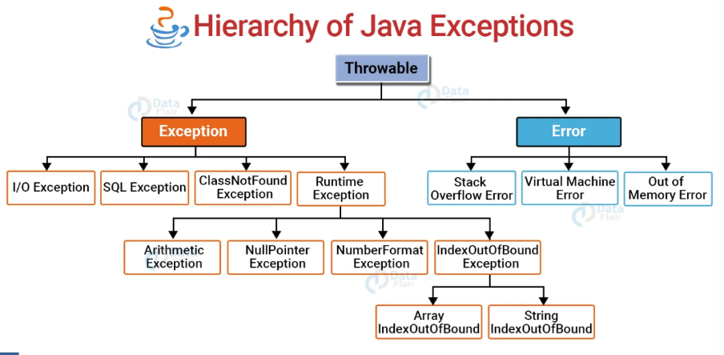

# Exception

Exception adalah kejadian yang tidak diinginkan atau tidak terduga, yang terjadi selama eksekusi suatu program (runtime), yang mengganggu keberjalanan program. Exception dapat ditangkap dan ditangani oleh program.

Exception ini memiliki mekanisme seperti menangani unexpected/unwanted saat runtime seperti tipe-tipe dalam Exception class yaitu: `ClassNotFoundException`, `IOException`, `SQLException`, `RemoteException`, dll. Mekanisme tersebut dinamakan `Exception handling`

Berikut adalah Hierarki dari Exception class



## Penjelasan Lanjut

`Exception handling` ini pasti terdapat hampir setiap projek java, karena ada beberapa perintah/method/dll memerlukan `Exception handling` dan itu bersifat wajib, walaupun kamu yakin codemu/perhitunganmu tidak salah tetapi program tetap meminta perintah/method/dll tersebut dilakukan `Exception handling`

## Exception handling `TryCatch` techniques

Teknik yang biasa dipakai adalah teknik TryCatch, berikut sintaksnya

```java
try{
    //Code yang dijalankan, dan merekam jika ada kesalahan
}catch{
    //Handling jika code terdapat kesalahan
}
```

Pada kode diatas, kalian bisa lihat `try` bisa dibilang seperti pemulai perekaman dalam suatu code dan pedeteksi error. `catch` akan berjalan jika ada suatu error, jika tidak ada error maka akan ter-*skip*

pada `catch` harus diikuti tipe dari Exception class didalam kurung.

```java
public class JavaExceptionExample{  
    public static void main(String args[]){  
        try{  //kode yang mungkin ada exception
            int data=100/0;  
        } catch(ArithmeticException e){
            System.out.println(e);
        }  
        //kode lainnya yang akan dijalankan   
        System.out.println("rest of the code...");  
    }  
}
```

### finally

## Exception handling `throws` techniques

Pada `Exception handling` juga terdapat teknik `throws` yang diikuti tipe dari Exception class, yang dimana teknik tersebut hanya ditempatkan dalam suatu fungsi yang diwajibkan pakai `Exception handling`

Dalam fungsi yang sudah terdapat `throws` tidak perlu ditambahakan `TryCatch`. Tetapi pemanggil fungsi tersebut harus didalam `TryCatch`.

```java
public class ExceptionExample {
    public static void main(String[] args) {
        try {
            int result = divide(10, 0);
            System.out.println("Result: " + result);
        } catch (ArithmeticException e) {
            System.out.println("Error: " + e.getMessage());
        } finally {
            System.out.println("Execution complete.");
        }
    }
    public static int divide(int a, int b) throws ArithmeticException {
        return a / b;
    }
}
```

## Custom Exceptions

Anda bisa membuat Exception sendiri dengan tambahkan `extends Exception` kepada class punyamu yang mau dijadikan sebagai peng-*custom* Exception, berikut contohnya

```java
public class MyCustomException extends Exception {
    public MyCustomException(String message) {
        super(message);
    }
}
public void checkValue(int value) throws MyCustomException {
    if (value < 0) {
        throw new MyCustomException("Value cannot be negative");
    }
}
```

# Assertions

Sebuah `assertion` dapat menguji kebenaran dari asumsi yang sudah dibuat dalam program. Untuk menggunakan `assertion`, digunakan keyword assert dalam bahasa Java. Ketika menjalankan `assertion`, pernyataan tersebut diyakini bernilai benar (true). Apabila pernyataan tersebut ternyata salah, JVM akan melempar (throws) error bernama `Assertion`Error. `Assertion` biasa digunakan untuk testing ketika melakukan development.

## Sintaks dari Assertion

```java
assert condition : "Error message";
```

Pada code diatas dalam perintah assert ada condition yang menghasilkan hasil diatara `true` atau `false`, jika `true` tidak akan memprint `"Error message"` dan sebaliknya. Berikut contohnya:

```java
public void checkAge(int age) {
    assert age > 0 : "Age must be positive";
    System.out.println("Age is " + age);
}
```

jika `age` lebih kecil daripada 0 maka akan print error `"Age must be positive"` tetapi program tetap bisa menjalankan/memprint `"Age is " + age`.

## Enabling dan Disabling Assertions

### Enabling Assertions

By default, assertions are disabled at runtime. To enable assertions, use the -ea flag when running the program: `java -ea MyProgram`

### Disabling Assertions

Assertions can be disabled with the -da flag: `java -da MyProgram`

# Kesimpulan

**Exception** digunakan untuk menangani kondisi tak terduga atau kesalahan secara terkontrol.

**Assertions** digunakan untuk memvalidasi asumsi selama pengembangan; tidak dimaksudkan untuk penanganan kesalahan di tingkat produksi.

Gunakan keduanya secara efektif untuk menulis kode yang tangguh dan bebas dari kesalahan.