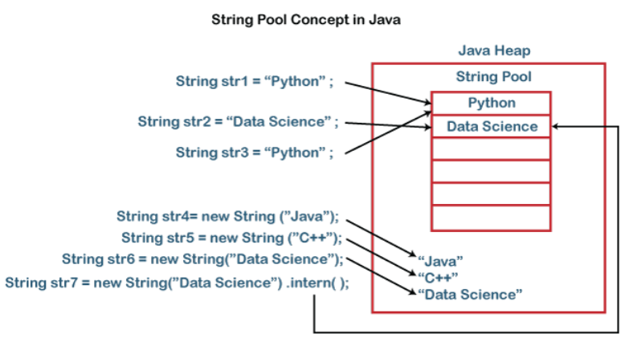

# String class

String merupakan sebuah nilai tunggal yang berisikan kumpulan dari character.

## Method pada String class

| Metode                                | Deskripsi                                            |
|---------------------------------------|-----------------------------------------------------|
| `length()`                            | Mengembalikan panjang string.                       |
| `charAt(int index)`                   | Mengembalikan karakter pada indeks tertentu.        |
| `substring(int beginIndex)`           | Mengembalikan substring dari indeks yang diberikan. |
| `substring(int beginIndex, int endIndex)` | Mengembalikan substring antara dua indeks.        |
| `indexOf(String str)`                 | Mengembalikan indeks kemunculan pertama substring.  |
| `toLowerCase()`                       | Mengubah string menjadi huruf kecil.                |
| `toUpperCase()`                       | Mengubah string menjadi huruf besar.                |
| `trim()`                              | Menghapus spasi di awal dan akhir string.           |
| `replace(char oldChar, char newChar)` | Mengganti semua karakter yang cocok.                |
| `equals(String anotherString)`        | Membandingkan dua string untuk kesamaan.            |
| `equalsIgnoreCase(String anotherString)` | Membandingkan dua string tanpa memperhatikan besar kecil huruf. |

## String Immutability

Immutability itu kekal, yang berarti kalau string sudah terbuat, itu sudah tidak bisa di *modified*, operasi apapun itu akan menghasilkan string baru

```java
String s1 = "Java";
s1 = s1.concat(" Programming");
System.out.println(s1); // output : Java Programming
```

String itu kekal karena untuk membuat operasi thread lebih aman dan masalah performa

## String Pool dan Memori

Java menggunakan area memori khusus yang disebut String Pool untuk menyimpan literal string. Ketika Anda membuat literal string, Java memeriksa apakah string tersebut sudah ada di dalam pool. Jika sudah ada, Java mengembalikan referensi ke string yang sudah ada; jika belum, Java akan menambahkan string tersebut ke dalam pool.

Lihat kode dibawah

```java
String s1 = "Java";
String s2 = "Java";
System.out.println(s1 == s2); // Output: true (same reference in the pool)
```

diatas memiliki output berupa `true`, sekarang lihat kode dibawah ini

```java
String s1 = new String("Java");
String s2 = "Java";
System.out.println(s1 == s2); // Output: false (different memory locations)
```

Mengapa false, karena Ketika Anda membuat sebuah string menggunakan keyword new, sebuah objek baru akan dibuat di dalam heap, terlepas dari apakah string yang identik sudah ada di dalam pool atau tidak.

### Berikut conceptnya



## StringBuilder

