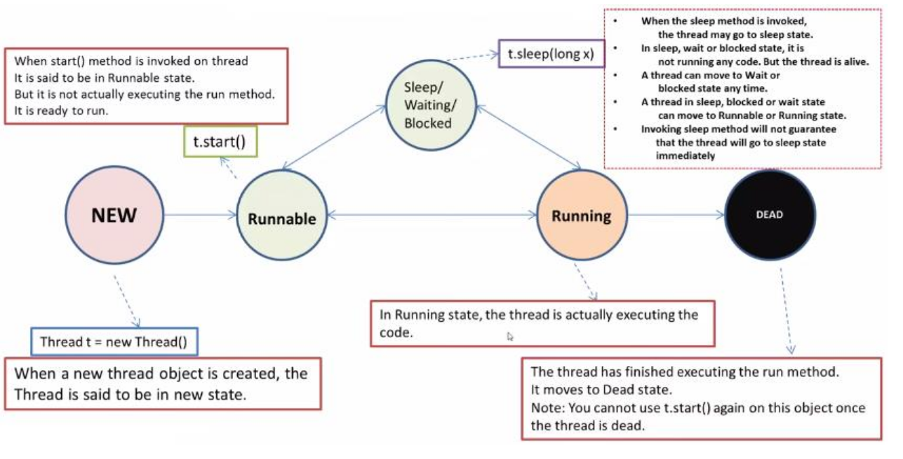

# Multithreading

## Apa itu Multithread

suatu kemampuan yang memungkinkan beberapa kumpulan instruksi atau proses dapat dijalankan secara bersamaan dalam sebuah program. Satu kumpulan instruksi yang akan dieksekusi secara independen dinamakan Thread. Multithreading memungkinkan beberapa thread berjalan secara bersamaan, membantu memaksimalkan penggunaan sumber daya dan meningkatkan kinerja.

## Kenapa pakai Multithread

- Meningkatkan performa aplikasi (paralelisme)
- Pemanfaatan sumber daya yang lebih optimal (misalnya, prosesor multi-core)
- Memungkinkan tugas asinkron (seperti tugas latar belakang)

## Implementasi Thread class

```java
class MyThread extends Thread{
    public void run(){
        System.out.println("Thread is running.");
    }
}

public class Main{
    public static void main(String[] args) {
        MyThread thread1 = new MyThread();
        MyThread thread2 = new MyThread();
        thread1.start();
        thread2.start();
    }
}
```

Dalam sintaks ini terdapat instansiasi 2 objek berupa `thread1` dan `thread2` kedua objek tersebut bisa diperlakukan seperti objek pada umumnya atau thread.

Pada objek tersebut sebenarnya bisa memakai fungsi `run` dengan hanya memanggil `thread1.run();` tetapi itu hanya menjalankan seperti fungsi pada umumnya.

Tetapi jika memanggil sama seperti pada dicode yaitu `thread1.start();`. Fungsi tersebut akan mengambil alih fungsi `run` dan menjalankan thread pada fungsi tersebut.

### Impelementasi memakai Runnable Interface

```java
class MyRunnable implements Runnable {
    public void run() {
        System.out.println("Thread is running.");
    }
}

public class Main {
    public static void main(String[] args) {
        Thread thread1 = new Thread(new MyRunnable());
        Thread thread2 = new Thread(new MyRunnable());

        thread1.start();
        thread2.start();
    }
}

```

Implementasi diatas sama seperti implementasi thread pada umumnya tetapi yang berbeda adalah classnya tidak `extends Thread` melainkan `implements Runnable` dan instansiasi objeknya.

Deklarasinya memakai tipe data `Thread` tapi didalamnya terdapat Inisialisasi class `Runnable` jadi seperti ini, seperti `new Thread(new MyRunnable());`.

## Thread States

- **NEW** : Sebuah thread yang belum dimulai berada dalam status ini.
- **RUNNABLE** : Sebuah thread yang sedang dieksekusi di Java Virtual Machine berada dalam status ini.
- **BLOCKED** : Sebuah thread yang terblokir karena menunggu kunci monitor berada dalam status ini.
- **WAITING** : Sebuah thread yang menunggu tanpa batas waktu hingga thread lain melakukan aksi tertentu berada dalam status ini.
- **TIMED_WAITING** : Sebuah thread yang menunggu thread lain untuk melakukan aksi dalam batas waktu tertentu berada dalam status ini.
- **TERMINATED** : Sebuah thread yang telah selesai dieksekusi berada dalam status ini.



## Method pada Thread

1. `start()`

    Metode ini digunakan untuk memulai eksekusi thread. Itu mengakibatkan pemanggilan metode run() pada objek Thread.

    ```java
    Thread myThread = new MyThread();
    myThread.start();
    ```

2. `sleep(long milliseconds)`
   
   Metode ini memaksa thread saat ini untuk tidur selama jangka waktu tertentu (dalam milidetik).

   ```java
    try {
        Thread.sleep(1000); // Thread tidur selama 1 detik
    } catch (InterruptedException e) {
        e.printStackTrace();
    }
    ```

3. `join()`
   
   Metode ini membuat thread yang memanggilnya menunggu sampai thread yang disebutnya selesai.

    ```java
    Thread anotherThread = new AnotherThread();
    anotherThread.start();
    try {
        anotherThread.join(); // Menunggu sampai thread selesai
    } catch (InterruptedException e) {
        e.printStackTrace();
    }
    ```

4. `isAlive()`
   
    Metode ini mengembalikan true jika thread masih hidup atau false jika telah selesai.

    ```java
    if (myThread.isAlive()) {
        System.out.println("Thread masih berjalan.");
    } else {
        System.out.println("Thread telah selesai.");
    }
    ```

5. `setName() dan getName()`
   
   Metode `setName()` digunakan untuk menetapkan nama thread, sedangkan `getName()` untuk mendapatkan nama thread.

    ```java
    myThread.setName("MyThread");
    String threadName = myThread.getName();
    ```

6. `interupt()`
   
   Metode ini digunakan untuk menghentikan thread yang sedang tidur atau dalam keadaan terblokir.

    ```java
    myThread.interrupt();
    ```

7. `currentThread()`
   
   Metode yang digunakan untuk mendapatkan referensi ke thread saat ini yang sedang dieksekusi.

    ```java
    Thread.currentThread();
    ```
## Refrensi

- [Materi Multithread dari Asdos](https://github.com/Monashr/PBO-2024-main/blob/master/W11_Multithread/Materi.md)
- Materi Multithread dari Pak Afrizal